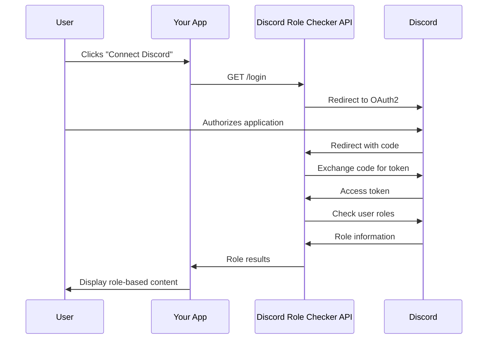

# 📚 Discord Role Checker API Documentation

Complete API reference for the Discord Role Checker service. This document covers all endpoints, authentication flows, and integration patterns.

## 🚀 Base URL

```
https://discord-role-checker.vercel.app
```

## 🔐 Authentication

The API uses Discord OAuth2 for authentication. Users must authorize your application with the following scopes:
- `identify` - Access to user's basic information
- `guilds.members.read` - Access to check user's roles in guilds

## 📋 API Endpoints

### **Health & Status**

#### `GET /health`
Check API health and configuration.

**Response:**
```json
{
  "status": "OK",
  "timestamp": "2025-01-27T10:30:00.000Z",
  "guilds": [
    {
      "name": "NADS",
      "guildId": "1036357772826120242",
      "roleId": "1051562453495971941",
      "roleName": "NADS Role"
    },
    {
      "name": "SLMND",
      "guildId": "1325852385054031902",
      "roleId": "1329565499335381033",
      "roleName": "Riverborn"
    },
    {
      "name": "LAMOUCH",
      "guildId": "1329166769566388264",
      "roleId": "1337881787409371372",
      "roleName": "Mouch OG"
    }
  ],
  "clientId": "1404438843112820756"
}
```

#### `GET /api`
Get API documentation and available endpoints.

**Response:**
```json
{
  "name": "Discord Role Checker API",
  "version": "1.0.0",
  "endpoints": [
    "GET /health - Health check",
    "GET /api - This documentation",
    "GET /login - Discord OAuth2 login",
    "GET /callback - OAuth2 callback",
    "GET /nads - Check NADS role",
    "GET /slmnd - Check SLMND role",
    "GET /lamouch - Check LAMOUCH role",
    "POST /check-role/:guild - Check role with token"
  ]
}
```

### **OAuth2 Authentication**

#### `GET /login`
Redirects user to Discord OAuth2 authorization page.

**Query Parameters:**
- None

**Response:**
- HTTP 302 redirect to Discord OAuth2 page

**Example:**
```javascript
// Redirect user to Discord OAuth2
window.location.href = 'https://discord-role-checker.vercel.app/login';
```

#### `GET /callback`
Handles OAuth2 callback and returns comprehensive role information.

**Query Parameters:**
- `code` (required) - OAuth2 authorization code from Discord

**Response:**
```json
{
  "success": true,
  "results": {
    "NADS": {
      "guildId": "1036357772826120242",
      "guildName": "NADS",
      "roleId": "1051562453495971941",
      "roleName": "NADS Role",
      "hasRole": true,
      "success": true
    },
    "SLMND": {
      "guildId": "1325852385054031902",
      "guildName": "SLMND",
      "roleId": "1329565499335381033",
      "roleName": "Riverborn",
      "hasRole": false,
      "success": true
    },
    "LAMOUCH": {
      "guildId": "1329166769566388264",
      "guildName": "LAMOUCH",
      "roleId": "1337881787409371372",
      "roleName": "Mouch OG",
      "hasRole": true,
      "success": true
    }
  },
  "summary": {
    "totalGuilds": 3,
    "rolesHeld": 2,
    "totalRoles": 3
  }
}
```

**Error Response:**
```json
{
  "success": false,
  "error": "Invalid authorization code",
  "message": "The provided authorization code is invalid or expired"
}
```

### **Individual Role Checking**

#### `GET /nads`
Check if user has NADS role in the NADS guild.

**Headers:**
- `Authorization: Bearer <access_token>` (required)

**Response:**
```json
{
  "guildId": "1036357772826120242",
  "guildName": "NADS",
  "roleId": "1051562453495971941",
  "roleName": "NADS Role",
  "hasRole": true,
  "success": true
}
```

**Error Response:**
```json
{
  "guildId": "1036357772826120242",
  "guildName": "NADS",
  "roleId": "1051562453495971941",
  "roleName": "NADS Role",
  "hasRole": false,
  "success": false,
  "error": "User not a member of this guild"
}
```

#### `GET /slmnd`
Check if user has Riverborn role in the SLMND guild.

**Headers:**
- `Authorization: Bearer <access_token>` (required)

**Response:**
```json
{
  "guildId": "1325852385054031902",
  "guildName": "SLMND",
  "roleId": "1329565499335381033",
  "roleName": "Riverborn",
  "hasRole": true,
  "success": true
}
```

#### `GET /lamouch`
Check if user has Mouch OG role in the LAMOUCH guild.

**Headers:**
- `Authorization: Bearer <access_token>` (required)

**Response:**
```json
{
  "guildId": "1329166769566388264",
  "guildName": "LAMOUCH",
  "roleId": "1337881787409371372",
  "roleName": "Mouch OG",
  "hasRole": true,
  "success": true
}
```

### **Advanced Role Checking**

#### `POST /check-role/:guild`
Check role for a specific guild using an access token.

**Path Parameters:**
- `guild` - Guild identifier (nads, slmnd, lamouch)

**Headers:**
- `Content-Type: application/json`

**Request Body:**
```json
{
  "accessToken": "user_discord_access_token"
}
```

**Response:**
```json
{
  "guildId": "1036357772826120242",
  "guildName": "NADS",
  "roleId": "1051562453495971941",
  "roleName": "NADS Role",
  "hasRole": true,
  "success": true
}
```

## 🔄 OAuth2 Flow

### **Complete Authentication Flow**



### **Step-by-Step Implementation**

#### **1. Start Authentication**
```javascript
function startDiscordAuth() {
    // Redirect user to Discord OAuth2
    window.location.href = 'https://discord-role-checker.vercel.app/login';
}
```

#### **2. Handle Callback**
```javascript
async function handleOAuth2Callback(code) {
    try {
        const response = await fetch(
            `https://discord-role-checker.vercel.app/callback?code=${code}`
        );
        
        if (!response.ok) {
            throw new Error(`HTTP error! status: ${response.status}`);
        }
        
        const results = await response.json();
        
        if (results.success) {
            // Process role results
            const userRoles = results.results;
            const summary = results.summary;
            
            // Check specific roles
            const hasNADS = userRoles.NADS?.hasRole || false;
            const hasSLMND = userRoles.SLMND?.hasRole || false;
            const hasLAMOUCH = userRoles.LAMOUCH?.hasRole || false;
            
            // Handle role-based logic
            handleRoleBasedAccess(hasNADS, hasSLMND, hasLAMOUCH);
        } else {
            console.error('Authentication failed:', results.error);
        }
    } catch (error) {
        console.error('Error handling OAuth2 callback:', error);
    }
}
```

#### **3. Check URL Parameters on Page Load**
```javascript
document.addEventListener('DOMContentLoaded', function() {
    const urlParams = new URLSearchParams(window.location.search);
    const code = urlParams.get('code');
    
    if (code) {
        // User is returning from Discord OAuth2
        handleOAuth2Callback(code);
        
        // Clear URL parameters
        window.history.replaceState({}, document.title, window.location.pathname);
    }
});
```

## 🎯 Use Case Examples

### **Content Gating**

```javascript
class ContentGate {
    constructor() {
        this.requiredRoles = [];
        this.userRoles = null;
    }
    
    setRequiredRoles(roles) {
        this.requiredRoles = roles;
    }
    
    async authenticate() {
        window.location.href = 'https://discord-role-checker.vercel.app/login';
    }
    
    async handleCallback(code) {
        const response = await fetch(
            `https://discord-role-checker.vercel.app/callback?code=${code}`
        );
        const results = await response.json();
        
        if (results.success) {
            this.userRoles = results.results;
            this.checkAccess();
        }
    }
    
    checkAccess() {
        if (this.requiredRoles.length === 0) {
            this.showContent();
            return;
        }
        
        const hasRequiredRole = this.requiredRoles.some(role => 
            this.userRoles[role]?.hasRole
        );
        
        if (hasRequiredRole) {
            this.showContent();
        } else {
            this.showAccessDenied();
        }
    }
    
    showContent() {
        document.getElementById('gated-content').style.display = 'block';
        document.getElementById('auth-prompt').style.display = 'none';
    }
    
    showAccessDenied() {
        document.getElementById('access-denied').style.display = 'block';
        document.getElementById('auth-prompt').style.display = 'none';
    }
}

// Usage
const gate = new ContentGate();
gate.setRequiredRoles(['NADS']); // Requires NADS role
```

### **Role-Based Features**

```javascript
class RoleBasedFeatures {
    constructor() {
        this.features = {
            'NADS': ['basic-access', 'community-chat'],
            'SLMND': ['premium-content', 'exclusive-events'],
            'LAMOUCH': ['vip-access', 'beta-features']
        };
    }
    
    async checkUserRoles(code) {
        const response = await fetch(
            `https://discord-role-checker.vercel.app/callback?code=${code}`
        );
        const results = await response.json();
        
        if (results.success) {
            this.enableFeatures(results.results);
        }
    }
    
    enableFeatures(userRoles) {
        // Enable features based on roles
        Object.entries(userRoles).forEach(([guild, data]) => {
            if (data.hasRole && this.features[guild]) {
                this.features[guild].forEach(feature => {
                    this.enableFeature(feature);
                });
            }
        });
    }
    
    enableFeature(featureName) {
        const element = document.querySelector(`[data-feature="${featureName}"]`);
        if (element) {
            element.classList.remove('disabled');
            element.classList.add('enabled');
        }
    }
}
```

## 🚨 Error Handling

### **Common Error Codes**

| Status Code | Error Type | Description |
|-------------|------------|-------------|
| 400 | Bad Request | Missing or invalid parameters |
| 401 | Unauthorized | Missing or invalid access token |
| 403 | Forbidden | User lacks required permissions |
| 404 | Not Found | User not a member of the guild |
| 429 | Too Many Requests | Rate limited by Discord API |
| 500 | Internal Server Error | Server-side error |

### **Error Response Format**

```json
{
  "success": false,
  "error": "Error type",
  "message": "Human-readable error description",
  "details": {
    "guildId": "1036357772826120242",
    "roleId": "1051562453495971941"
  }
}
```

### **Rate Limiting**

The API respects Discord's rate limits (50 requests/second per token). When rate limited:

```json
{
  "success": false,
  "error": "Rate Limited",
  "message": "You are being rate limited. Please try again later.",
  "retryAfter": 60
}
```

## 🔒 Security Considerations

### **Access Token Security**

- **Never store access tokens in localStorage** - Use secure HTTP-only cookies or server-side storage
- **Implement token refresh** - Discord access tokens expire
- **Validate tokens server-side** - Don't trust client-side token validation

### **CORS Configuration**

The API supports cross-origin requests. Ensure your frontend domain is properly configured.

### **HTTPS Requirement**

Always use HTTPS in production. The API is deployed with SSL/TLS encryption.

## 📊 Response Schema

### **Role Check Response Schema**

```json
{
  "guildId": "string",      // Discord guild ID
  "guildName": "string",    // Human-readable guild name
  "roleId": "string",       // Discord role ID
  "roleName": "string",     // Human-readable role name
  "hasRole": "boolean",     // Whether user has the role
  "success": "boolean"      // Whether the check was successful
}
```

### **OAuth2 Callback Response Schema**

```json
{
  "success": "boolean",     // Overall success status
  "results": {              // Role check results for each guild
    "GUILD_NAME": {
      // Role check response schema
    }
  },
  "summary": {              // Summary statistics
    "totalGuilds": "number",
    "rolesHeld": "number",
    "totalRoles": "number"
  }
}
```

## 🧪 Testing

### **Test with cURL**

```bash
# Health check
curl https://discord-role-checker.vercel.app/health

# Check NADS role (requires valid access token)
curl -H "Authorization: Bearer YOUR_ACCESS_TOKEN" \
     https://discord-role-checker.vercel.app/nads

# Check SLMND role
curl -H "Authorization: Bearer YOUR_ACCESS_TOKEN" \
     https://discord-role-checker.vercel.app/slmnd

# Check LAMOUCH role
curl -H "Authorization: Bearer YOUR_ACCESS_TOKEN" \
     https://discord-role-checker.vercel.app/lamouch
```

### **Test OAuth2 Flow**

1. Visit: `https://discord-role-checker.vercel.app/login`
2. Authorize with Discord
3. Check the callback response

## 📚 Additional Resources

- **Discord Developer Portal**: https://discord.com/developers/applications
- **Discord OAuth2 Documentation**: https://discord.com/developers/docs/topics/oauth2
- **API Health Check**: https://discord-role-checker.vercel.app/health
- **Live API**: https://discord-role-checker.vercel.app

## 🆘 Support

If you encounter issues:

1. Check the health endpoint: `/health`
2. Verify your Discord application configuration
3. Ensure you're using the correct OAuth2 scopes
4. Check Discord API status: https://status.discord.com
5. Open an issue on GitHub

---

**Ready to integrate? Start with the examples above and customize them for your application!** 🚀
